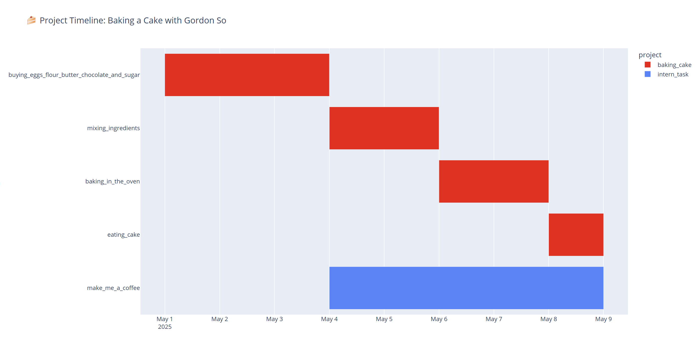

# lightweight-object-oriented-gantt

very simple not much here - this program is a lightweight object oriented gantt chart based on plotly + pandas.

The GUI is vscode and the gantt chart versions are tracked through github.
- This was chosen for agility of both programming and for the user to use.

# User Guide:

There are three files:
- core.py --> contains all objects - abstractions the user of the program does not need to interact with (don't change)
- task_list.py --> is the input file for the user to enter the tasks (add tasks here)
- main.py --> this is the file that will ask for additional user input and create the gantt chart (run this file)

When you run main.py, the program will prompt you with a few different ways to color the graph:
>1 --> Color by project
>2 --> Color by assignee
>3 --> Color by completion status where red means unstarted, yellow means working on and green means complete
>4 --> Color by critical_rank where the most critical rank is red
>5 --> Select a task with dependencies and color all task dependencies red and the task with dependencies blue
>Enter a number to select how to color the gantt chart: 

Once the number is selected, the program will start a local web server and automatically open the gantt chart in your browser with plotly. This lets you interact with the full app in your browser without needing an internet connection or deploying it online. This provides a lot of interactive features like zooming in and data when hovering over tasks.

For entering deadlines and tasks in tasks_list.py, ctrl+F and vscode are intended to be used as the GUI.

## Creating Deadlines:
The deadlines are added to the "deadlines" list in task_list.py

copy the following template into the deadlines list and replace the <> with text:

>       Deadline(
>           deadline_name="<str>",
>           deadline_date=date( <input year int>, <input month int>, <input day int>),
>       ),

### where:
- deadline_name: is the name of the deadline.
- deadline_date in (YYYY/MM/DD)

## Creating Tasks:
The tasks are added to the "tasks" list in task_list.py

copy the following template into the tasks list and replace the <> with text.
for fields with multiple <> below, they are interpreted by the program as lists, which can have a single entry as required. For multiple entries make sure to split them with commas

Note: for consistency, every string is converted to: snake_case
This means that the input project strings: "Make   me  a COFFEE" and "make me a coffee" will both be sorted under the project "make_me_a_coffee"

>        Task(
>            task_name="<str>",
>            project="str",
>
>            start_date=date( <input year int>, <input month int>, <input day int>),
>            end_date=date( <input year int>, <input month int>, <input day int>),
>            status=<int>,  
>            critical_rank=<int>,                                      #can also set critical_rank to None, or add more fields if desired
>            assignee="str",
>            dependencies="<str> ","<str>"                             #can also set critical_rank to None, or add more fields if desired
>        ),

### where:
- task_name: is the name of the task. Each task must have a unique name
- project: Every task belongs to a project ex: "mixing ingredients" is a task of the "cake baking" project
- start date in (YYYY/MM/DD)
- end date in (YYYY/MM/DD)
- status is an int where 0 = not started, 1 = started but not complete, 2 = complete
- critical rank **is a string (in double quotes)** arbitrarily set by the user to rank which tasks are most pressing. Can be left blank for non critical tasks
- assignee is the person working on the task
- dependencies are an optional list of all the tasks that must be completed before the the task they are in.

## Setup:

You will need the following:
- python - make sure to check the "add to path option"
- vscode
- github desktop

once you have all 3 softwares:
1) use github desktop to "clone" this repository
2) download all the required python libraries with the following command in terminal:
> pip install -r requirements.txt
Note: make sure you have pip installed